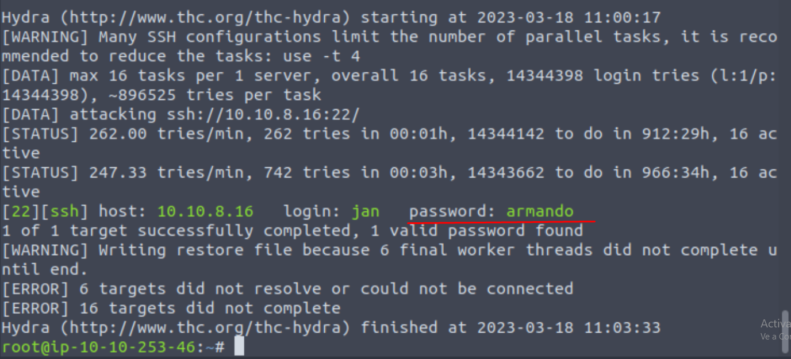

# Basic Pentesting

Buenas, 
aquí vamos a hablar de como hacer la Room Basic Pentesting,\
en resumen es una máquina inicial para practicar hacking a una aplicación web.\
La veo muy adecuada para la gente que empieza en el mundillo del hacking\
ya que se usan algunas de las técnicas más conocidas como fuerza bruta, hash cracking, enumeración.
\
\
Iniciamos la máquina y una vez esté arrancada revisamos su ip.\
En mi caso es 10.10.8.16, pero vosotros usad la vuestra
y poned la vpn\
Lo primero que hacemos es un ping para comprobar que está la máquina lista.

Vamos a hacer el escaneo de servicios con un nmap completo

Las CTFs suelen tener los servicios en puertos no estándar, 
es recomendable escanear todo el rango de puertos aunque tarden más.\
Ahora bien, los puertos abiertos que tenemos más interesantes son el SSH y HTTP para esta máquina.
Seguimos las pautas de TryHackMe, nos enfocamos en el HTTP\
Revisemoslo.

Está en "mantenimiento", comprobaremos si tiene alguna otra ruta con gobuster\
herramienta que prueba diferentes rutas sobre una máquina objetivo
y te dice si existen o no, potencialmente encontrando páginas ocultas.\
Para poder utilizar esta herramienta correctamente necesitamos una IP
y un diccionario, el diccionario en realidad son un montón de palabras escritas
en un archivo txt y que dirb las coge de una en una para probar rutas.

Veamos el comando:

Podemos ver que la página "secreta" es development, vamos a echarle un vistazo

Vemos que hay un par de archivos.

dev.txt nos comenta que hay un SMB, y que menciona una versión eso es información valiosa.\
j.txt es una carta a un tal J y su compañero le dice que su contraseña es muy insegura
por medio de **Hash Cracking**.
Teniendo en cuenta que la contraseña de ese tal J es bastante fácil de romper...
seguramente sea viable hacer una fuerza bruta por SSH.
Hacemos un enum4linux para comprobar si nos da usuarios.

Se puede entrar como usuario anónimo. (con SMB aunque no lo he hecho por esa ruta)\
Pero más interesante es que hemos encontrado a los usuarios de las cartas que son Jan y Kay.\
Nos facilita mucho la fuerza bruta, vamos a hacerlo con Hydra y  el usuario jan

Tachán! Tenemos la contraseña de Jan
Nos metemos por ssh.

Y estamos dentro.
Hacemos un ls y nos vamos situando.

pass.bak requiere escalada de privilegios.
probamos a ver .ssh de Kay.

Podemos crackear la llave porque esta encriptada, tenemos que desencriptarla

Ahora si le hacemos el john

Y finalmente hacemos el ssh 

Estamos con Kay y hacemos cat del pass.bak para terminar el ejercicio

